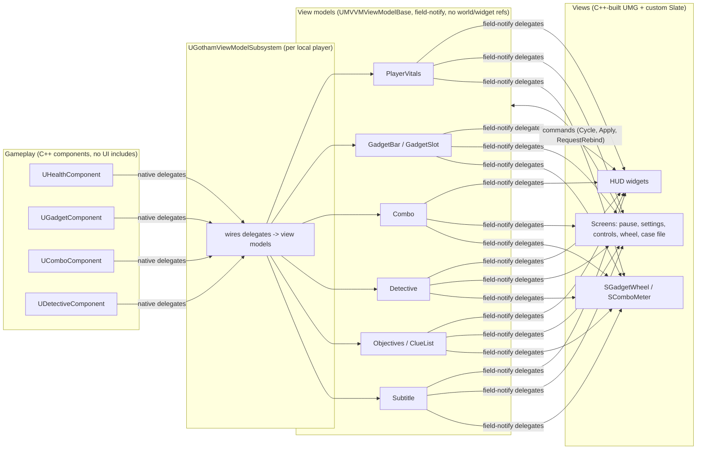

# Architecture

## One rule

**Gameplay never knows the UI exists, and widgets never change gameplay state directly.** Everything else follows
from that.

Data flows one way (gameplay -> view model -> view). User intent goes back through input actions and view-model
commands, never by a widget reaching into a component.

## Layers

| Layer | Location | May depend on | Must not depend on |
|---|---|---|---|
| Gameplay | `Source/MVVMSample/Gameplay` | Engine | UI, view models |
| View models | `ViewModels/` | Gameplay *types* only where a component is the source | Widgets, the world |
| Pure logic | `Accessibility/`, `Input/GothamBindings.*`, `UI/Layout/GothamUITypes.h`, `UI/Slate/GothamWheelTypes.h` | Core | Everything else |
| Views | `UI/` | View models, Slate, UMG, Common UI | Gameplay components |
| Glue | `ViewModels/GothamViewModelSubsystem`, `Core/GothamPlayerController` | Both sides | n/a |

"Pure logic" is deliberately UObject-free where possible (settings data, palette, binding conflict resolution, wheel
hit-testing, layer/input-context tracking) so the rules are unit-tested without a world.

## UI structure

- **Layer stack.** `UGothamPrimaryLayout` holds four Common UI activatable stacks (Game, GameMenu, Menu, Modal).
  `UGothamUISubsystem` is the only place screens are pushed and popped; `FGothamUIModeTracker` derives the input
  context (gameplay vs menu) from what is open.
- **Screens.** Everything full-screen derives `UGothamScreen` (input config, Esc / B to go back, default focus,
  small builders for titles, buttons and hint bars). The HUD is a screen in the Game layer. `BuildMenuFrame` gives
  menus one look (background blur, a left-heavy scrim, section label, title and rule) and a content slide on
  activation; the layer stacks (`UGothamScreenStack`) add a 0.15 s fade on push and pop. Both are off under reduced
  motion.
- **Prompts and toggles.** Hint-bar prompts are `UGothamHintButton`s: not focusable, and clicking one does what its
  key does. "Accept" restores the item that had focus before the pointer arrived (clicking lets Slate move focus to
  the screen), then sends Enter. A screen with `ToggleActionName` closes when any key bound to that action is
  pressed. The keys come from the Enhanced Input key profile, because the gameplay context is inactive while a menu
  is open. `-GothamMenuInputTest` checks both through Slate's input path.
- **Menu focus.** `UGothamMenuList` draws a highlight bar behind the current item. It is event-driven:
  `NativeOnFocusChanging` finds which item is on the new focus path, and `SGothamHighlight` eases toward it with
  `FGothamSlideRect` (tested), reading the target's geometry only while the list holds focus. Buttons and option rows
  move focus on hover, so mouse and gamepad share one "current item". Option rows handle left and right in
  `NativeOnNavigation`, so the d-pad, stick and arrow keys change values while up and down still move between rows.
- **Tabs.** Settings uses `UCommonTabListWidgetBase` (`UGothamTabList`) linked to a `UCommonAnimatedSwitcher`; the
  grouping is data (`USettingsViewModel::GetTabs`).
- **Widgets build their own tree** in `RebuildWidget` (see ADR 0002) and bind to view models with field-notify
  delegates through `GothamMVVM::Bind(VM, this, &Handler, { Fields... })` / `GothamMVVM::Unbind(VM, this)`
  (`ViewModels/GothamMVVM.h`). Fields on a per-frame fast path (combo decay, gadget cooldowns) are routed by field
  id inside the handler, or bound to their own handler with a second `Bind`. Anything that restyles on settings changes subscribes through `FGothamSettingsListener` (a member
  that unsubscribes itself, scoped to its owner); `UGothamSettingsAwareWidget` wraps it for plain user widgets.
- **Custom Slate.** `SGadgetWheel` (custom vertices, angle hit-testing) and `SComboMeter` (segmented, eased) wrapped as
  `UWidget`s (`UGadgetWheel`, `UComboMeter`) so designers can place and bind them.
- **Threats.** `UGothamThreatSubsystem` (a world subsystem) runs the thugs with pure rules (`FGothamThugBrain`,
  `FGothamAttackDirector`) and publishes a snapshot list per frame. `UGothamViewModelSubsystem` forwards it to
  `UThreatViewModel` (field-notify counts, plain per-frame array), and `UThreatIndicatorLayer` draws prompts and edge
  arrows in one Slate pass. Gameplay never sees the widgets, and the widgets never see the actors.
- **Lists.** The case file is a `UTileView` (evidence board) over `UClueEntryViewModel`s; tiles are pooled and
  rebind or cancel thumbnail streaming when recycled. Selection follows navigation and drives a detail pane.

## Input

Enhanced Input assets are created in code (`AGothamPlayerController::BuildInputAssets`): actions and mapping context
need no binary assets. Rebindable actions carry player-mappable settings (ADR 0005); rebinding goes through
`UEnhancedInputUserSettings`. Glyph widgets query the live mapping (`QueryKeysMappedToAction`) and follow the current
input device (Common Input), so rebinding and device switches are reflected without extra code.

## Settings, accessibility, localization

- `FGothamSettingsData` (plain struct, persisted in GameUserSettings.ini) is edited via `USettingsViewModel` with live
  preview and Apply / Revert / Defaults. `UGothamSettingsSubsystem` applies side effects and broadcasts.
- Colours are semantic tokens (`GothamPalette`), resolved per colour-vision preset and high contrast; nothing in UI code
  uses a literal colour for meaning. The Detective post-process takes its clue colours as material parameters.
- Text is `FText` (LOCTEXT / string table). `Scripts/Localize.bat` runs UE's gather -> translate -> compile; English,
  German, Japanese and an `en-XA` pseudo-locale are included.

## Detective Mode (the cross-cutting feature)

One eased alpha (`UDetectiveComponent`) drives everything so it stays coherent: the post-process material and FOV pinch
(`UDetectiveVisionComponent`, world side) and the overlay material, HUD label and tracker (`UDetectiveViewModel`, UI
side). Clues are `UClueDataAsset`s placed as `AClueActor`s; custom depth + stencil makes them draw through walls.

## Testing

Automation specs live in `Source/MVVMSample/Tests`. They cover view-model behaviour, component logic (via `Advance()`
so unregistered components can be driven), input/palette/settings rules and rebinding. Run them with
`Scripts/run_tests.py` (exit code reflects failures). Visual verification uses the dev flags documented in the README.
