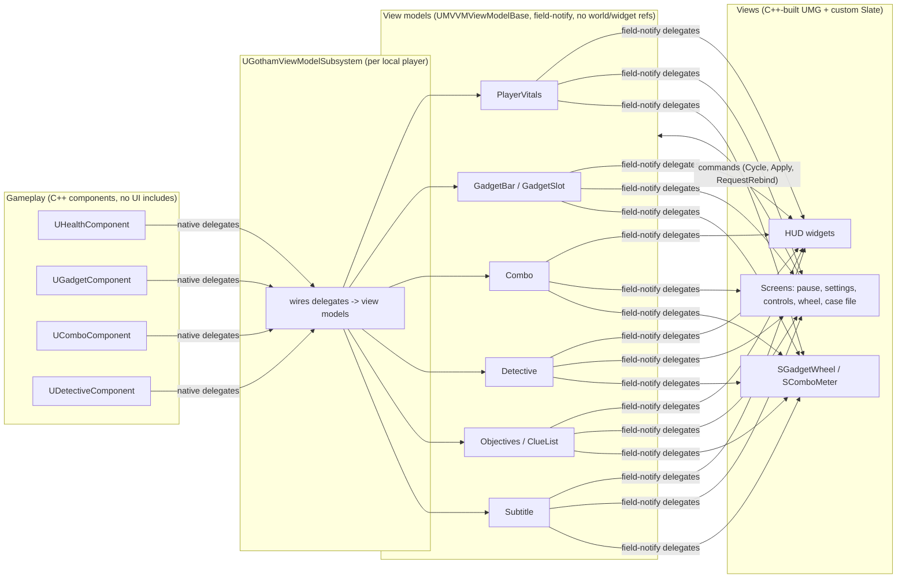

# Architecture

## One rule

**Gameplay never knows the UI exists, and widgets never change gameplay state directly.** Everything else follows
from that.

Data flows one way (gameplay -> view model -> view). User intent goes back through input actions and view-model
commands, never by a widget reaching into a component.

## Layers

| Layer | Location | May depend on | Must not depend on |
|---|---|---|---|
| Gameplay | `Source/MVVMSample/Gameplay` | Engine | UI, view models |
| View models | `ViewModels/` | Gameplay *types* only where a component is the source | Widgets, the world |
| Pure logic | `Accessibility/`, `Input/GothamBindings.*`, `UI/Layout/GothamUITypes.h`, `UI/Slate/GothamWheelTypes.h` | Core | Everything else |
| Views | `UI/` | View models, Slate, UMG, Common UI | Gameplay components |
| Glue | `ViewModels/GothamViewModelSubsystem`, `Core/GothamPlayerController` | Both sides | n/a |

"Pure logic" is deliberately UObject-free where possible (settings data, palette, binding conflict resolution, wheel
hit-testing, layer/input-context tracking) so the rules are unit-tested without a world.

## UI structure

- **Layer stack.** `UGothamPrimaryLayout` holds four Common UI activatable stacks (Game, GameMenu, Menu, Modal).
  `UGothamUISubsystem` is the only place screens are pushed and popped; `FGothamUIModeTracker` derives the input
  context (gameplay vs menu) from what is open.
- **Screens.** Everything full-screen derives `UGothamScreen` (input config, Esc / B to go back, default focus,
  small builders for titles, buttons and hint bars). The HUD is a screen in the Game layer.
- **Widgets build their own tree** in `RebuildWidget` (see ADR 0002) and bind to view models with field-notify
  delegates. `UGothamSettingsAwareWidget` adds live restyling from accessibility settings.
- **Custom Slate.** `SGadgetWheel` (custom vertices, angle hit-testing) and `SComboMeter` (segmented, eased) wrapped as
  `UWidget`s (`UGadgetWheel`, `UComboMeter`) so designers can place and bind them.
- **Lists.** The case file uses `UListView` over `UClueEntryViewModel`s; rows are pooled and rebind/cancel thumbnail
  streaming when recycled.

## Input

Enhanced Input assets are created in code (`AGothamPlayerController::BuildInputAssets`): actions and mapping context
need no binary assets. Rebindable actions carry player-mappable settings (ADR 0005); rebinding goes through
`UEnhancedInputUserSettings`. Glyph widgets query the live mapping (`QueryKeysMappedToAction`) and follow the current
input device (Common Input), so rebinding and device switches are reflected without extra code.

## Settings, accessibility, localization

- `FGothamSettingsData` (plain struct, persisted in GameUserSettings.ini) is edited via `USettingsViewModel` with live
  preview and Apply / Revert / Defaults. `UGothamSettingsSubsystem` applies side effects and broadcasts.
- Colours are semantic tokens (`GothamPalette`), resolved per colour-vision preset and high contrast; nothing in UI code
  uses a literal colour for meaning. The Detective post-process takes its clue colours as material parameters.
- Text is `FText` (LOCTEXT / string table). `Scripts/Localize.bat` runs UE's gather -> translate -> compile; English,
  German, Japanese and an `en-XA` pseudo-locale are included.

## Detective Mode (the cross-cutting feature)

One eased alpha (`UDetectiveComponent`) drives everything so it stays coherent: the post-process material and FOV pinch
(`UDetectiveVisionComponent`, world side) and the overlay material, HUD label and tracker (`UDetectiveViewModel`, UI
side). Clues are `UClueDataAsset`s placed as `AClueActor`s; custom depth + stencil makes them draw through walls.

## Testing

Automation specs live in `Source/MVVMSample/Tests`. They cover view-model behaviour, component logic (via `Advance()`
so unregistered components can be driven), input/palette/settings rules and rebinding. Run them with
`Scripts/run_tests.py` (exit code reflects failures). Visual verification uses the dev flags documented in the README.
