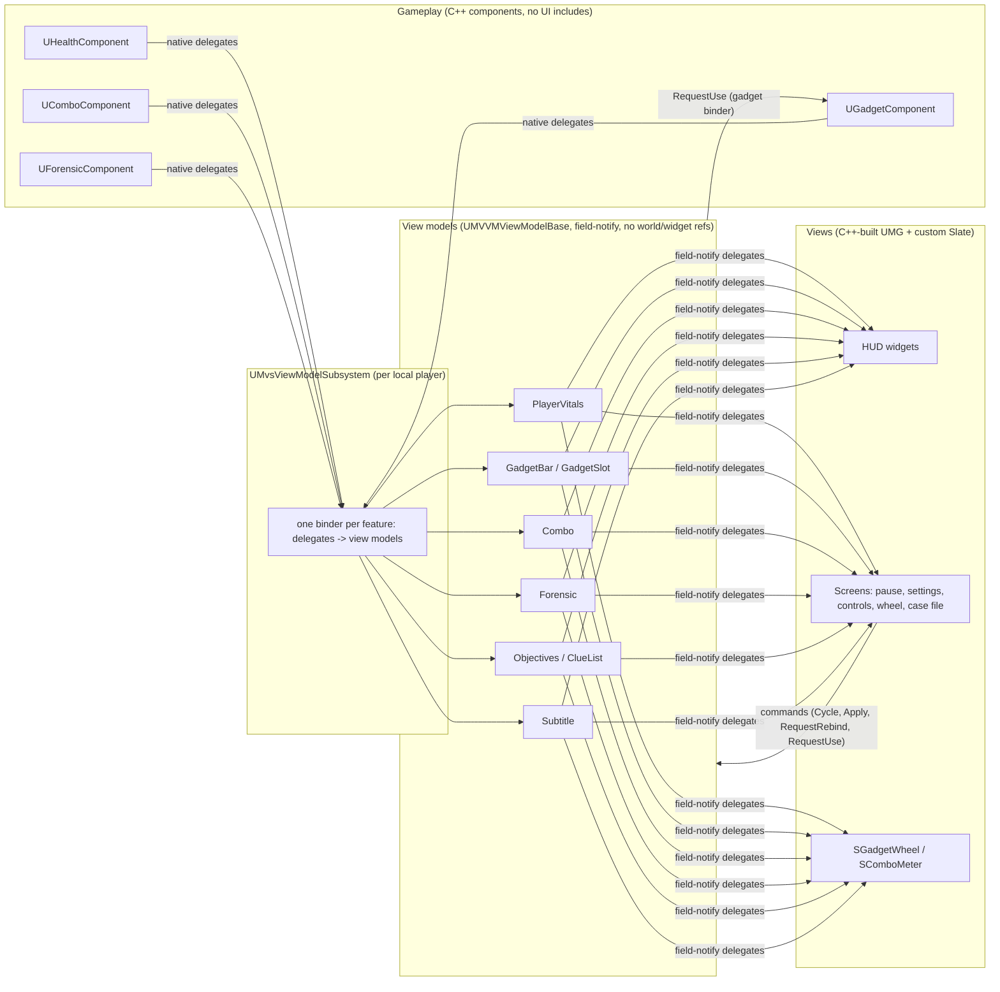

# Architecture

## One rule

**Gameplay never knows the UI exists, and widgets never change gameplay state directly.** Everything else follows
from that.

Data flows one way (gameplay -> view model -> view). User intent goes back through input actions and view-model
commands, never by a widget reaching into a component.

## Layers

| Layer | Location | May depend on | Must not depend on |
|---|---|---|---|
| Gameplay | `Source/MVVMSample/Gameplay` | Engine | UI, view models |
| View models | `ViewModels/` | Gameplay *types* only where a component is the source | Widgets, the world |
| Pure logic | `Accessibility/`, `Input/MvsBindings.*`, `UI/Layout/MvsUITypes.h`, `UI/Slate/MvsWheelTypes.h` | Core | Everything else |
| Views | `UI/` | View models, Slate, UMG, Common UI | Gameplay components |
| Glue | `ViewModels/MvsViewModelSubsystem` and its binders (`MvsViewModelBinders`), `Core/MvsPlayerController` | Both sides | n/a |

"Pure logic" is deliberately UObject-free where possible (settings data, palette, binding conflict resolution, wheel
hit-testing, layer tracking) so the rules are unit-tested without a world.

## UI structure

- **Layer stack.** `UMvsPrimaryLayout` holds four Common UI activatable stacks (Game, GameMenu, Menu, Modal).
  `UMvsUISubsystem` is the only place screens are pushed and popped; `FMvsUIModeTracker` tracks what is open
  (whether a menu is up). The keys that open screens are data: `UMvsUISettings::GetShortcuts` lists each gameplay
  action, the layer, the screen-class setting it opens and how its key behaves (pause: open or back; the case file:
  toggle over any menu; the gadget wheel: hold, from gameplay only). The player controller binds every row to
  `UMvsUISubsystem::HandleShortcut`, and the generic layer names no feature.
- **Screens.** Every menu and modal derives `UMvsScreen` (Menu input config, Common UI's back handler, default
  focus, small builders for titles, buttons and the action bar). The HUD is a plain activatable widget in the Game
  layer. `BuildMenuFrame` gives
  menus one look (background blur, a left-heavy scrim, section label, title and rule) and a content slide on
  activation; the layer stacks (`UMvsScreenStack`) add a 0.15 s fade on push and pop. Both are off under reduced
  motion.
- **Prompts and toggles** (ADR 0007). A screen's keys are Common UI bindings it registers: back (the activatable back
  handler), accept, the key that opened it and the other screens' toggle keys (both from the shortcut table), the wheel's press and release, the
  tab list's tab actions. Only the active screen's bindings fire. The prompt row is a bound action bar
  (`UMvsActionBar`) of `UMvsHintButton`s: not focusable, showing the key of the device in use, and clicking one
  runs its binding. Clicking first restores the item that had focus before the pointer arrived (clicking lets Slate move
  focus to the screen), so "Select" clicks that item through `IMvsAcceptable`. The functional menu tests
  (`Mvs.Functional.*`, one per screen) check all of it through Slate's input path.
- **Menu focus.** `UMvsMenuList` draws a highlight bar behind the current item. It is event-driven:
  `NativeOnFocusChanging` finds which item is on the new focus path, and `SMvsHighlight` eases toward it with
  `FMvsSlideRect` (tested), reading the target's geometry only while the list holds focus. Buttons and option rows
  move focus on hover, so mouse and gamepad share one "current item". Option rows handle left and right in
  `NativeOnNavigation`, so the d-pad, stick and arrow keys change values while up and down still move between rows.
- **Tabs.** Settings uses `UCommonTabListWidgetBase` (`UMvsTabList`) linked to a `UCommonAnimatedSwitcher`; the
  grouping is data (`USettingsViewModel::GetTabs`).
- **Widgets build their own tree** in `RebuildWidget` (see ADR 0002) and bind to view models with field-notify
  delegates through `MvsMVVM::Bind(VM, this, &Handler, { Fields... })` / `MvsMVVM::Unbind(VM, this)`
  (`ViewModels/MvsMVVM.h`). Fields on a per-frame fast path (combo decay, gadget cooldowns) are routed by field
  id inside the handler, or bound to their own handler with a second `Bind`. Anything that restyles on settings changes subscribes through `FMvsSettingsListener` (a member
  that unsubscribes itself, scoped to its owner); `UMvsSettingsAwareWidget` wraps it for plain user widgets.
- **Custom Slate.** `SGadgetWheel` (custom vertices, angle hit-testing) and `SComboMeter` (segmented, eased) wrapped as
  `UWidget`s (`UGadgetWheel`, `UComboMeter`) so designers can place and bind them.
- **Threats.** `UMvsThreatSubsystem` (a world subsystem) runs the thugs with pure rules (`FMvsThugBrain`,
  `FMvsAttackDirector`) and publishes a snapshot list per frame. `UMvsViewModelSubsystem` forwards it to
  `UThreatViewModel` (field-notify counts, plain per-frame array), and `UThreatIndicatorLayer` draws prompts and edge
  arrows in one Slate pass. Gameplay never sees the widgets, and the widgets never see the actors.
- **World overlays.** Clue markers and threat indicators share one shape: `UMvsWorldOverlayLayer` (UMG: owning
  player, projection into the HUD canvas, on / off from view-model state) over `SMvsWorldOverlay<TItem>` (Slate: a
  provider fills the frame's items on an active timer, one paint pass draws them). Inactive means no timer and no
  paint, so an overlay costs nothing until its mode is on. A new overlay supplies the item struct, the provider, the
  paint and `ShouldBeActive`.
- **Lists.** The case file is a `UTileView` (evidence board) over `UClueEntryViewModel`s; tiles are pooled and
  rebind or cancel thumbnail streaming when recycled. Selection follows navigation and drives a detail pane.

## Input

Enhanced Input assets are created in code from one table (`Input/MvsActionTable`: name, display text, value type,
default keyboard and gamepad keys, rebindable), so actions and the mapping context need no binary assets.
`AMvsPlayerController::BuildInputAssets` loops over the table, `FindAction` looks actions up by name, and the
Controls screen's rows (`MvsBindings::GetDefinitions`) are the table's rebindable entries in order. Rebindable actions carry player-mappable settings (ADR 0005); rebinding goes through
`UEnhancedInputUserSettings`.

The gameplay context and the menu context (`UMvsUIInputData`: accept, back, previous / next tab) are both added once
and stay on. While a menu is open Common UI's Menu input mode keeps keys from reaching the game, so nothing swaps
contexts (ADR 0007). Glyphs show the key Common UI resolves for the current device
(`CommonUI::GetFirstKeyForInputType`) and refresh when Enhanced Input rebuilds its mappings, so rebinding and device
switches are reflected without extra code.

## Settings, accessibility, localization

- `FMvsSettingsData` (plain struct, persisted in GameUserSettings.ini) is owned by `UMvsSettingsSubsystem`, the model:
  it applies side effects and broadcasts, and `Preview`, `Commit` and `Revert` are its calls. It knows no view model.
  The settings screen creates its own `USettingsViewModel` (a working copy with live preview and Apply / Revert /
  Defaults), hands its edits to those calls, and `Sync`s it whenever the subsystem broadcasts. The view model owns one
  `USettingRowViewModel` per option (label, value text, description, choice index and count, all field notify), and
  each option row binds its own: stepping one option re-reads one row.
  No setting writes engine-global state from UI code: UI scale is a DPI scaler inside the primary layout, and the
  language (process-wide culture) is restored when a preview is reverted, when settings close without applying, and
  when the game instance shuts down (so a play-in-editor session never leaves the editor in another language).
- Screen classes load asynchronously when the layout is created (`UMvsUISettings::GetPreloadPaths`) and stay
  loaded; `UMvsUISettings::Resolve` warns if one is ever loaded on demand. Only the HUD loads synchronously, at
  level start.
- Colours are semantic tokens (`MvsPalette`), resolved per colour-vision preset and high contrast; nothing in UI code
  uses a literal colour for meaning. The Forensic post-process takes its clue colours as material parameters.
- **One style source.** `FMvsTheme` (`MvsStyle::Theme(Context)`) is the resolved look of the current settings:
  palette, panel opacity, motion, text size. Leaves style themselves from it: `UMvsText` keeps its type style (and
  optionally a colour token) and re-applies both on settings changes, `UMvsSwatch` does the same for flat accent
  blocks, and the world overlays restyle their Slate layers. Anything a widget styles by hand goes in one hook,
  `ApplyTheme` (screens and overlays receive the theme, resolved once per settings change; settings-aware widgets
  re-read their view models); interaction state (hover, focus, press) is `ApplyState()`, which reads a theme the
  button keeps from the last settings change rather than resolving one per focus or hover change.
  Layout numbers are named in `UI/Style/MvsMetrics.h`, which the menu-input test reads too.
- **Text size** (Accessibility tab) multiplies every UMG font on top of UI scale; subtitles keep their own size, and
  the custom-painted Slate layers (wheel, markers) keep the default.
- **Safe zones.** Edge-anchored HUD elements and the menu column sit in a `USafeZone`; full-screen layers (blur,
  overlays, vignette) stay full screen. Checked with `r.DebugSafeZone.TitleRatio` in the menu-input test.
- **Screen readers** (`UI/MvsAccessibility.h`). Menu buttons announce their label, settings rows "label: value",
  prompts "action (key)", and the custom Slate layers a sentence of their own (the wheel's selection, clues in view,
  incoming attacks). Set on the Slate widget a reader lands on; checked through `GetAccessibleText` in the test.
- Text is `FText` (LOCTEXT / string table). `Scripts/Localize.bat` runs UE's gather -> `.po` import / export -> compile (translations live in one `.po` per culture); English,
  German, Japanese and an `en-XA` pseudo-locale are included.

## Forensic Mode (the cross-cutting feature)

One eased alpha (`UForensicComponent`) drives everything so it stays coherent: the post-process material and FOV pinch
(`UForensicVisionComponent`, world side) and the overlay material, HUD label and tracker (`UForensicViewModel`, UI
side). Clues are `UClueDataAsset`s placed as `AClueActor`s; custom depth + stencil makes them draw through walls.

## Testing

Automation specs live in their own module, `Source/MVVMSampleTests` (a DeveloperTool module: built for the editor and
Development builds, never for Shipping), so the game module holds no test code. Tests use the game's exported API and
explicit test-access friends (`FMvsInputTestAccess`). The dev aids that drive the game (flags, the perf harness,
`FMvsScript`) stay in the game module, compiled out of Shipping. The specs cover view-model behaviour, component logic (via `Advance()`
so unregistered components can be driven), input/palette/settings rules and rebinding. Run them with
`Scripts/run_tests.py` (exit code reflects failures). It runs two passes: the editor pass (headless) and a game pass
for `Mvs.Functional.*`, latent tests that need the running game: one per screen (HUD, case file, pause, settings,
key bindings, gadget wheel) plus the view-model resolver, each starting and ending with no menu open, driving focus,
hit-testing, prompt clicks and toggle keys through Slate's own input path (`MvsMenuTestKit.h`). Visual verification uses the dev
flags documented in the README.

Everything that drives the running game on its own is a script for one runner, `FMvsScript`
(`Core/MvsScript.h`): the dev flags (`Core/MvsDevAids.cpp`, compiled out of Shipping), the perf harness and the
functional menu tests. A script is a list of steps (`At`, `Wait`, `Do`, `Expect`, `Sample`, `Screenshot`, `Quit`) run in
real time on the core ticker, so paused and slowed screens do not stop it; its timing rules are unit-tested with a
fake clock. A new demo or check is a short step list, not a new ticker.

## Wiring gameplay to view models

`UMvsViewModelSubsystem` holds one binder per feature (`ViewModels/MvsViewModelBinders.h`: vitals, gadgets,
combo, forensic, threats, clues). A binder creates its feature's view models, subscribes to the character's
components when the controller binds a pawn, and pushes their current state. Subscriptions go into
`FMvsSubscriptions`, which removes them on `Reset` and holds sources weakly, so no binder tracks delegate handles.
The subsystem finds view models by class for widgets and for `UMvsViewModelResolver`.

Commands go back through view models, not around them: the wheel calls `UGadgetBarViewModel::RequestUse`, which the
gadget binder hands to the character; the controls view model applies rebinds itself through `IMvsBindingStore`
(Enhanced Input's user settings in the game, memory in tests). Views subscribe to view models in code (ADR 0008).
UI asks for gameplay actions through `IMvsActionSource`, not the concrete player controller.
